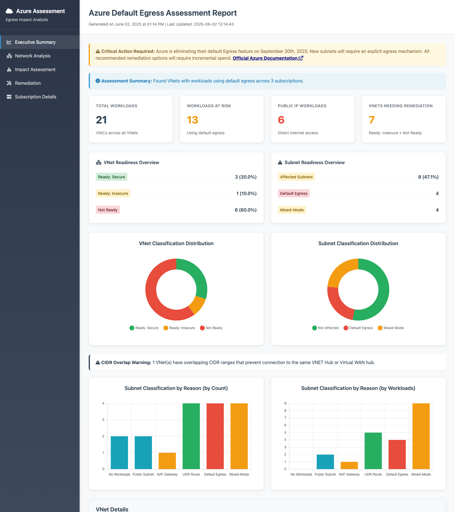

# Azure Default Egress Assessment Tool

A comprehensive assessment tool developed by Aviatrix to help Azure customers evaluate their exposure to Microsoft's upcoming default internet egress changes and plan their migration strategy.

Microsoft Azure is retiring default outbound access for Virtual Machines, fundamentally changing how internet egress works in Virtual Networks. This change will impact resources that currently rely on Azure's automatic internet routing without explicit configuration.

## Sample Report

Get instant visibility into your Azure environment's egress configuration and security posture:



*Comprehensive Azure Default Egress Assessment Report showing executive summary, network analysis, and detailed remediation recommendations.*

## 🚀 Quick Launch

**🔒 100% Local Execution** - Uses your existing Azure credentials, no data transmitted to Aviatrix or external services.

### Prerequisites

- **Azure Access**: Account with read permissions across target subscriptions
- **Authentication**: Azure CLI (recommended) or PowerShell module configured  
- **Python**: Version 3.6 or higher (auto-installed if missing)
- **Internet Connection**: For downloading dependencies and script updates

### One-Line Execution

**macOS/Linux:**
```bash
curl -sSL https://raw.githubusercontent.com/cmchenr/azure-default-egress-assessment/main/scripts/azure-egress-check.sh | bash
```

**Windows PowerShell:**
```powershell
iwr -useb https://raw.githubusercontent.com/cmchenr/azure-default-egress-assessment/main/scripts/azure-egress-check.ps1 | iex
```

The tool will automatically:
- ✅ Install required dependencies
- ✅ Use your existing Azure CLI/PowerShell credentials  
- ✅ Scan all accessible subscriptions
- ✅ Generate comprehensive HTML report with timestamp
- ✅ Keep all data local on your system

## Understanding Azure's Default Egress Change

### What is Default Egress?

Azure Default Egress is a feature that automatically provides internet connectivity to Virtual Machines without requiring explicit configuration. According to [Microsoft's decision tree](https://learn.microsoft.com/en-us/azure/virtual-network/ip-services/default-outbound-access), a subnet uses default egress when:

1. **No Route Table Applied**: The subnet doesn't have a route table configured
2. **No Explicit Internet Route**: If a route table exists, it lacks an explicit 0.0.0.0/0 route
3. **No NAT Gateway**: The subnet doesn't have an Azure NAT Gateway configured
4. **Workloads Without Public IPs**: VMs in these subnets don't have public IP addresses assigned

### Impact and Timeline

While Microsoft has indicated that existing subnets and workloads may not be immediately affected, **new subnets** created in VNets without explicit egress configuration will lose internet connectivity. This makes it critical to prepare your VNets with proper egress mechanisms before creating new subnets.

### The Security Imperative

Beyond compliance with Azure's changes, addressing default egress represents a significant security improvement. Internet egress is the primary vector attackers use for:

- **Command & Control**: Establishing persistent communication channels
- **Data Exfiltration**: Stealing sensitive information from your environment  
- **Malware Download**: Retrieving additional attack tools and payloads
- **Botnet Participation**: Using compromised resources for distributed attacks

Implementing proper egress controls with firewall capabilities can prevent these attack vectors and significantly improve your security posture.

## Assessment Tool Features

This tool analyzes your Azure environment to identify egress dependencies and provide actionable migration guidance:

### Analysis Capabilities

- **Multi-Subscription Discovery**: Automatically scans all accessible Azure subscriptions
- **VNet Classification**: Categorizes Virtual Networks based on egress readiness:
  - **Ready: Secure** - Firewalled egress with 0.0.0.0/0 UDRs detected
  - **Ready: Insecure** - NAT Gateway configured but no firewall protection
  - **Not Ready** - No explicit egress mechanism configured
- **Detailed Subnet Analysis**: Classifies each subnet's egress configuration
- **Workload Risk Assessment**: Identifies VMs with direct public IP exposure
- **Route Table Intelligence**: Analyzes UDR next-hop destinations and correlates with network appliances
- **CIDR Overlap Detection**: Identifies VNets that cannot share a common hub due to address conflicts
- **Remediation Prioritization**: Recommends action sequence based on complexity and risk

### Output Formats

The tool generates multiple output formats:

1. **HTML Dashboard** (Primary): Interactive charts, executive summary, and technical details
2. **Terminal Output**: Color-coded summary with progress tracking
3. **JSON Export** (Optional): Complete data in structured format for integration
4. **CSV Export** (Optional): Tabular format for spreadsheet analysis


### Advanced Usage Options

Customize your assessment with additional parameters:

```bash
# Target specific subscriptions
./azure-egress-check.sh --subscription-id "sub1-uuid,sub2-uuid"

# Export data and enable logging
./azure-egress-check.sh --export-json --export-csv --verbose
```

### What Happens When You Run It

1. **Environment Setup**: Automatically installs required Python dependencies
2. **Authentication**: Uses existing Azure CLI or PowerShell credentials
3. **Discovery**: Scans all accessible subscriptions for VNets and subnets
4. **Analysis**: Evaluates egress configurations and identifies risks
5. **Reporting**: Generates timestamped HTML report with detailed findings
6. **Output**: Displays summary in terminal with paths to detailed reports

## Remediation Strategies

### Immediate Actions for Different Scenarios

#### VNets Classified as "Not Ready"
**Issue**: No explicit egress mechanism configured
**Solutions**:
1. **Azure NAT Gateway** (Quick fix, limited security)
   - Provides immediate egress capability
   - Minimal security visibility and control

2. **Firewall with UDRs** (Recommended for production)
   - Route tables with 0.0.0.0/0 pointing to firewall
   - Aviatrix Cloud Firewall, Azure Firewall, or third-party NVAs
   - Enhanced security with traffic inspection and control

#### VNets Classified as "Ready: Insecure" - Replace NAT Gateway with Firewall
If your assessment shows "Ready: Insecure" VNets using NAT Gateways consider replacing them with a Firewall.

**Benefits of Firewall Upgrade**:
- **Threat Detection**: Identify malicious domains and suspicious traffic patterns
- **Data Loss Prevention**: Block unauthorized data exfiltration attempts  
- **Compliance**: Meet regulatory requirements for traffic inspection
- **Incident Response**: Detailed logs for security investigation

**Implementation Options**:
- **Aviatrix Cloud Firewall**: Advanced distributed architecture with global management
- **Azure Firewall**
- **Third-Party NVAs**


### Unique Scenarios Requiring Additional Considerations

#### Mixed-Mode Subnets
**Issue**: Requires additional considerations and modification of workloads prior to enabling Egress to a Firewall.
**Recommended Approach**:
1. **Subnet Redesign**: Separate VMs by egress method into dedicated subnets prior to enabling UDRs.  
2. **Public IP Migration**: The recommended path is to create a new subnet for public IPs with an Application Gateway.  Place VMs with public IPs behind the application gateway.  Migrate the public IP to the application gateway.

#### VNets with CIDR Overlaps
**Issue**: Requires a distributed firewall approach as VNETs with overlapping CIDRs cannot be connected to the same Azure VNET Hub.  Aviatrix provides multiple options to mitigate this challenge.
**Solutions**:
1. **Distributed Firewalls**: Deploy firewall in each VNet (Aviatrix and others)
2. **CIDR Readdressing**: Plan subnet migrations to eliminate overlaps (complex)

### Security Enhancement Recommendations


#### Aviatrix Cloud Firewall Advantages

For organizations seeking optimal security and operational efficiency, Aviatrix offers unique capabilities including distributed architecture, global management, CIDR overlap support, and cost optimization. Contact Aviatrix for detailed architecture review and consultation.

## Output Formats and Report Locations

All outputs are saved in the current directory with timestamps:
- `azure-egress-assessment-YYYYMMDD-HHMMSS.html`
- `azure-egress-assessment-YYYYMMDD-HHMMSS.json` (if requested)
- `azure-egress-assessment-YYYYMMDD-HHMMSS.csv` (if requested)

## Next Steps After Assessment

### 1. Review and Prioritize
- Address "Not Ready" VNets before creating new subnets
- Plan security upgrades for "Ready: Insecure" NAT Gateway configurations

### 2. Explore Aviatrix Solutions
For organizations seeking comprehensive cloud networking and security, contact Aviatrix for assessment, consultation, proof of concept, and migration planning.

## License and Support

**Copyright © 2025 Aviatrix Systems, Inc. All rights reserved.**